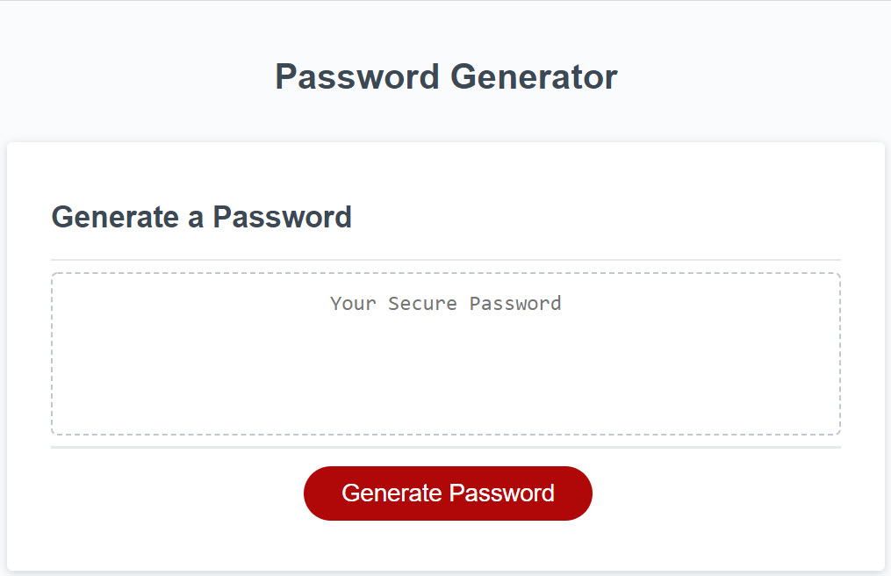

# Password Generator

## Purpose

This program generates a password between 8 and 128 characters long. It prompts the user for input in the form of selecting password criteria.

### Password Criteria Options:

- Lower case letters
- Upper case letters
- Numbers
- Symbols

## Validation

The program also validates that AT LEAST ONE character from each user-selected criteria is present in the password. This ensures that even though the character selection is random, there will be at least one character from every selected criteria type, or the password will automatically be regenerated and validated again.

The Password Generator is live at: concord511.github.io/Challenge3

## Screenshot

## Link to Live Page

https://concord511.github.io/Password-Generator/